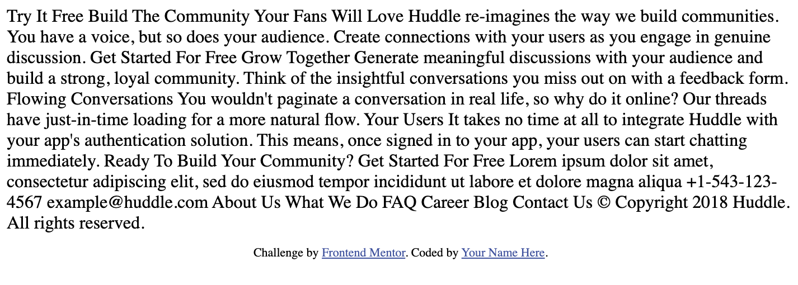

Frontend Mentor - Huddle landing page with alternating feature blocks solution

Frontend Mentor challenges help you improve your coding skills by building realistic projects.

++ Table of contents

- [Overview](#overview)
  - [Screenshot](#screenshot)
  - [Links](#links)
- [My process](#my-process)
  - [Built with](#built-with)
  - [Continued development](#continued-development)
- [Author](#author)

- Overview

  The goal of this challenge was to develop more practice building up a Landing page using what I have learnt so far in html,
  css and flexbox. This landing page requires the application of everything learnt so far and may require the learning of new
  concepts as well. The goal will be to get to look as close to as the design set by "Frontend Mentor - Huddle Landing page with
  alternating feature blocks".

  Users should be able to:

  - View the optimal layout for the site depending on their device's screen size
  - See hover states for all interactive elements on the page

- Screenshot

  How the project looks at the beginning, then the following section contains the link of how it looks now.

- Links

  Live Site URL: [https://viracocha-inti.github.io/Huddle-landing-page/]

- My process

  Since the page was just a big paragraph at the beginning, I began by dividing the work with 
 tags in the html document.
  Then I identified at least 5 major areas and started to organize them from top to bottom. For the most part I tried to complete
  one area before moving onto the next area. Once I was happy with how it looked, I then started working on how the layout looked
  depending on device screen size.

- Built with

  - Semantic HTML5 markup
  - CSS custom properties
  - Flexbox

- Continued development

  One area I found particularly difficult and that I still require more work with is the setting of position absolute and position relative.
  As the screen size changed, this area always became a mess, and it was a guessing game of how I should change the values. I know there
  must be an easier way to go about this. I definitely need to come back and work more with this aspect of CSS positioning.

- Author

* Website - [Samir Valencia / Viracocha-Inti](https://github.com/Viracocha-Inti)
* Frontend Mentor - [@Viracocha-Inti](https://www.frontendmentor.io/profile/Viracocha-Inti)
